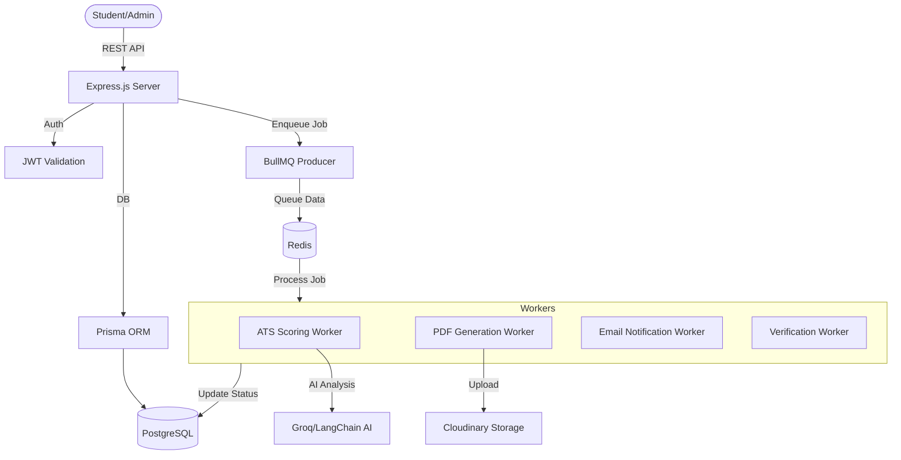

# AI-Powered Placement Management System

<div align="center">
  

  <p align="center">
    <a href="https://github.com/SahilMalakar/Ai_powered_placement_management/issues">
      
    </a>
    <a href="https://github.com/SahilMalakar/Ai_powered_placement_management/pulls">
      
    </a>
    <a href="https://github.com/SahilMalakar/Ai_powered_placement_management/blob/main/LICENSE">
      
    </a>
  </p>

  **Built with high-performance Node.js, TypeScript, and AI-driven automation.**
</div>

---

## 🚀 Overview

The **AI-Powered Placement Management System** is a production-grade backend solution designed to streamline the complex campus recruitment process. Built by **Sahil Malakar**, it replaces manual tracking with an automated, scalable pipeline that handles thousands of applications with precision.

Traditional placement cells struggle with manual eligibility verification and resume screening. This platform solves that by introducing an **Automated Eligibility Engine**, **AI Resume Scoring**, and **Asynchronous Job Processing**.

---

## ✨ Features

- **🛡️ RBAC & Secure Auth**: Fine-grained Role-Based Access Control for Students, Admins, and Super Admins using JWT.
- **⚙️ Eligibility Check Engine**: Real-time validation of CGPA, branch restrictions, and backlog counts before any job application.
- **🤖 ATS-Like AI Scoring**: Integrated with Groq/LangChain for intelligent resume analysis and match-percentage calculation.
- **📄 Async PDF Generation**: Scalable PDF export for resumes using BullMQ queues and Puppeteer workers.
- **📸 Immutable Snapshots**: Captures student profiles at the exact time of application to maintain historic data integrity.
- **📧 Automated Notifications**: Multi-channel email alerts for job activations and application status updates.
- **📈 High Performance**: Redis-based caching layer ensuring sub-100ms response times for common queries.
- **🐳 Cloud Ready**: Fully containerized with Docker, optimized for CI/CD workflows.

---

## 🛠️ Tech Stack

| Layer | Technologies |
| :--- | :--- |
| **Runtime** |   |
| **Framework** |  |
| **Database** |   |
| **Messaging** |   |
| **Infrastructure** |  |
| **AI/Cloud** |   |

---

## 🏗️ System Architecture



---

## 📁 Project Structure

```text
backend/
├── src/
│   ├── modules/          # MVC Modules (Auth, Student, Admin)
│   │   ├── auth/         # Controllers, Services, Repositories
│   │   ├── students/     # Eligibility logic, Applications
│   │   └── admin/        # Job Management, Analytics
│   ├── queues/           # BullMQ Queue definitions
│   ├── workers/          # Background Job workers (ATS, PDF, Mail)
│   ├── routes/           # API Routing (v1 Architecture)
│   ├── prisma/           # Database Schema & Migrations
│   ├── configs/          # Global configurations
│   ├── middlewares/      # Custom Express Middlewares (Auth, Validator)
│   └── utils/            # Shared utilities (Errors, Constants)
├── docker/               # Dockerfiles & Compose configurations
└── scripts/              # Maintenance & Automation scripts
```

---

## 🏁 Local Setup

Follow these steps to get the environment running locally.

### 1. Prerequisites
- **Node.js**: v20.x or higher
- **pnpm**: `npm install -g pnpm`
- **Docker & Docker Compose**

### 2. Clone & Install
```bash
git clone https://github.com/SahilMalakar/Ai_powered_placement_management.git
cd Ai_powered_placement_management/backend
pnpm install
```

### 3. Environment Configuration
Create a `.env` file in the `backend/` directory:
```bash
cp .env.examples .env
```

### 4. Database Setup
```bash
# Start Redis and PostgreSQL via Docker
docker-compose -f docker/docker-compose.yml up -d

# Generate Prisma client and push migrations
pnpm run db:generate
cd src && pnpm dlx prisma db push
```

### 5. Running the Application
```bash
# Development mode
pnpm run dev

# Production build
pnpm run build
pnpm run start
```

---

## 🔑 Environment Variables

| Variable | Description |
| :--- | :--- |
| `DATABASE_URL` | PostgreSQL connection string |
| `REDIS_URL` | Redis connection URL |
| `JWT_SECRET` | Secret for signing access tokens |
| `GROQ_API_KEY` | API Key for LLM-based resume analysis |
| `MAIL_USER` / `PASS` | SMTP credentials for notifications |
| `CLOUDINARY_*` | Cloudinary credentials for asset storage |

---

## 🛰️ API Reference (Core Endpoints)

| Method | Route | Description | Auth |
| :--- | :--- | :--- | :--- |
| `POST` | `/auth/signup` | Register new student | Public |
| `POST` | `/auth/login` | Login & get JWT | Public |
| `GET` | `/students/profile` | Get current student profile | JWT |
| `POST` | `/students/jobs/:jobId/apply` | Apply for job (Eligibility Check) | JWT |
| `POST` | `/students/resumes` | Generate AI-optimized resume | JWT |
| `GET` | `/v1/jobs` | List all available jobs | JWT |
| `POST` | `/admin/jobs` | Create new job posting | Admin |
| `PATCH` | `/admin/applications/status` | Bulk update application status | Admin |

---

## 🛠️ CI/CD & Deployment

The project includes a robust GitHub Actions pipeline:
- **Lint & Format**: Ensures code quality on every PR.
- **Build**: Validates TypeScript compilation.
- **Docker Push**: Automatically pushes built images to Docker Hub.
- **Auto-Deploy**: Connects to AWS EC2 via SSH and updates the containerized environment.

---

## 🤝 Contributing

Contributions are welcome! Please follow these steps:
1. Fork the Project.
2. Create your Feature Branch (`git checkout -b feature/AmazingFeature`).
3. Commit your Changes (`git commit -m 'Add some AmazingFeature'`).
4. Push to the Branch (`git push origin feature/AmazingFeature`).
5. Open a Pull Request.

---

## 📄 License

Distributed under the **ISC License**. See `LICENSE` for more information.

---

<div align="center">
  Developed by <a href="https://github.com/SahilMalakar">Sahil Malakar</a> with ❤️
</div>
