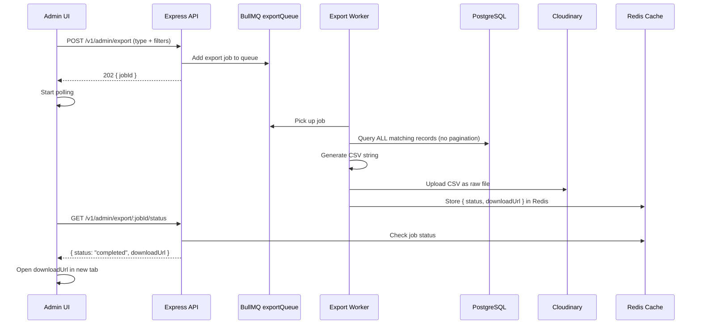
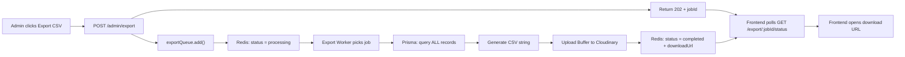

# CSV Export — Event-Driven Implementation Plan

## Architecture Overview



---

## Export Types

| Export Type | Key | CSV Columns |
|---|---|---|
| **Student Directory** | `students` | Full Name, Roll No, Email, Branch, CGPA, Has Backlog, Verification Status |
| **Job Applications** | `applications` | Job Title, Company, Student Name, Roll No, Email, Branch, CGPA, Application Status, Applied Date |

---

## Backend — Files to Create / Modify

### 1. New Type Definition

> [!NOTE]
> File: `src/types/admin/export.ts`

```typescript
import { z } from 'zod';
import { Branch, VerificationStatus, ApplicationStatus } from '../../prisma/generated/prisma/enums.js';

export const exportRequestSchema = z.object({
    type: z.enum(['students', 'applications']),
    // Student filters (used when type === 'students')
    search: z.string().optional(),
    branch: z.enum(Branch).optional(),
    cgpa: z.string().optional(),
    backlogAllowed: z.coerce.boolean().optional(),
    verificationStatus: z.enum(VerificationStatus).optional(),
    // Application filters (used when type === 'applications')
    status: z.union([z.enum(ApplicationStatus), z.literal('all')]).optional(),
    jobId: z.coerce.number().optional(),
});

export type ExportRequestInput = z.infer<typeof exportRequestSchema>;

// Shape stored in Redis for job tracking
export interface ExportJobResult {
    status: 'processing' | 'completed' | 'failed';
    downloadUrl?: string;
    error?: string;
    createdAt: string;
}
```

---

### 2. New Queue

> [!NOTE]
> File: `src/queues/export.queue.ts`

Pattern mirrors [document.queue.ts](file:///e:/Devlopment%20101/Tnp-placement-final-year/backend/src/queues/document.queue.ts).

```typescript
import { Queue } from 'bullmq';
import { getRedisConnection } from '../configs/redis.config.js';
import { InternalServerError } from '../utils/errors/httpErrors.js';
import type { ExportRequestInput } from '../types/admin/export.js';

export const EXPORT_QUEUE_NAME = 'exportQueue';

export interface ExportJobPayload extends ExportRequestInput {
    requestedBy: number; // Admin userId
}

export const exportQueue = new Queue(EXPORT_QUEUE_NAME, {
    connection: getRedisConnection() as any,
    defaultJobOptions: {
        attempts: 2,
        backoff: { type: 'exponential', delay: 3000 },
        removeOnComplete: true,
        removeOnFail: false,
    },
});

export const addExportJobToQueue = async (payload: ExportJobPayload) => {
    try {
        const job = await exportQueue.add(EXPORT_QUEUE_NAME, payload);
        return job;
    } catch (error) {
        console.error('[Export Queue] Error while adding job:', error);
        throw new InternalServerError('Failed to queue CSV export.');
    }
};
```

---

### 3. New Worker

> [!NOTE]
> File: `src/workers/export.worker.ts`

Pattern mirrors [document.worker.ts](file:///e:/Devlopment%20101/Tnp-placement-final-year/backend/src/workers/document.worker.ts).

**Core logic:**

1. Read `job.data.type` → branch to the correct Prisma query.
2. Query **all matching records** (same filters as the paginated endpoints, but **no `skip`/`take`**).
3. Map records to flat CSV row objects.
4. Convert to CSV string (using lightweight built-in logic — no extra dependency needed, just `Array.map` + `.join(',')`).
5. Upload the CSV `Buffer` to Cloudinary via `uploadBufferToCloudinary` (already exists) with `resource_type: 'raw'` and folder `csv_exports`.
6. Store the result in Redis with a 1-hour TTL:
   - Key: `export:job:{jobId}`
   - Value: `{ status: 'completed', downloadUrl, createdAt }`

**CSV generation** — No `json2csv` dependency needed. We build it manually:

```typescript
function toCsv(headers: string[], rows: Record<string, any>[]): string {
    const escape = (val: any) => {
        const str = String(val ?? '');
        return str.includes(',') || str.includes('"') || str.includes('\n')
            ? `"${str.replace(/"/g, '""')}"`
            : str;
    };
    const headerLine = headers.map(escape).join(',');
    const dataLines = rows.map(row =>
        headers.map(h => escape(row[h])).join(',')
    );
    return [headerLine, ...dataLines].join('\n');
}
```

**Student export query** — Reuses the same Prisma `where` clause from [students.repository.ts](file:///e:/Devlopment%20101/Tnp-placement-final-year/backend/src/modules/admin/repositories/students.repository.ts) but without `skip`/`take`:

```typescript
const students = await prisma.user.findMany({
    where, // same filter construction
    select: {
        email: true,
        profile: {
            select: {
                fullName: true, rollNo: true, branch: true,
                cgpa: true, backlog: true, verificationStatus: true,
            }
        }
    },
    orderBy: { createdAt: 'desc' }
});
```

**Application export query** — Reuses the same logic from [JobApplication.repository.ts](file:///e:/Devlopment%20101/Tnp-placement-final-year/backend/src/modules/admin/repositories/JobApplication.repository.ts) `getAllApplicationsRepository` but without `skip`/`take`:

```typescript
const applications = await prisma.application.findMany({
    where, // same filter construction
    include: {
        job: { select: { title: true, company: true } },
        user: {
            select: {
                email: true,
                profile: {
                    select: { fullName: true, rollNo: true, cgpa: true, branch: true }
                }
            }
        }
    },
    orderBy: { createdAt: 'desc' }
});
```

---

### 4. New Repository

> [!NOTE]
> File: `src/modules/admin/repositories/export.repository.ts`

Two functions — one per export type. Each builds the Prisma `where` clause from filters and queries **without pagination**.

---

### 5. New Controller

> [!NOTE]
> File: `src/modules/admin/controllers/export.controller.ts`

Two endpoints:

| Method | Route | Purpose | Response |
|---|---|---|---|
| `POST` | `/v1/admin/export` | Enqueue a new export job | `202 { jobId }` |
| `GET` | `/v1/admin/export/:jobId/status` | Poll for completion | `200 { status, downloadUrl? }` |

**POST handler:**
1. Validate body with `exportRequestSchema`.
2. Call `addExportJobToQueue({ ...body, requestedBy: req.user.userId })`.
3. Store initial status in Redis: `export:job:{jobId}` → `{ status: 'processing', createdAt }`.
4. Return `202 { jobId: job.id }`.

**GET handler:**
1. Read `export:job:{params.jobId}` from Redis.
2. If not found → `404`.
3. Return the status object.

---

### 6. New Route File

> [!NOTE]
> File: `src/routes/v1/admin/export.ts`

```typescript
import { Router } from 'express';
import { authMiddleware } from '../../../middlewares/auth.middleware.js';
import { requireAdmin } from '../../../middlewares/rbac.middleware.js';
import { requestExportController, getExportStatusController } from '../../../modules/admin/controllers/export.controller.js';

const exportRouter: Router = Router();

exportRouter.post('/', authMiddleware, requireAdmin, requestExportController);
exportRouter.get('/:jobId/status', authMiddleware, requireAdmin, getExportStatusController);

export { exportRouter };
```

---

### 7. Register in Index

> [!IMPORTANT]
> File: `src/routes/v1/index.ts` — Add one line

```diff
+import { exportRouter } from './admin/export.js';
 // ...
+router.use("/v1/admin/export", exportRouter);
```

---

### 8. Initialize Worker in Entry Point

> [!IMPORTANT]
> File: `src/index.ts` — Add one import + one call

```diff
+import { initializeExportWorker } from './workers/export.worker.js';
 // inside try block:
+    initializeExportWorker();
```

---

### 9. Cache Key

> [!NOTE]
> File: `src/utils/cacheKeys.ts` — Add one entry

```diff
+    EXPORT_JOB: (jobId: string) => `export:job:${jobId}`,
```

---

## Frontend — Files to Create / Modify

### 1. Service Function

> File: `src/services/admin/export.service.ts`

```typescript
import api from '@/lib/axios';

export const requestCsvExport = (data: { type: string; [key: string]: any }) =>
    api.post('/admin/export', data).then(r => r.data);

export const getExportStatus = (jobId: string) =>
    api.get(`/admin/export/${jobId}/status`).then(r => r.data);
```

### 2. Hook

> File: `src/hooks/admin/use-export.ts`

- `useRequestExport` — `useMutation` that calls `requestCsvExport`, then starts a `setInterval` polling `getExportStatus` every 2 seconds.
- On `status === 'completed'` → `toast.success('CSV ready!')` → open `downloadUrl` in a new tab (`window.open(url, '_blank')`).
- On `status === 'failed'` → `toast.error('Export failed.')`.
- Uses `toast.promise` wrapping the entire lifecycle.

### 3. UI Button

Add an **"Export CSV"** button (with `FileSpreadsheet` icon from `lucide-react`) to:
- **Student Directory page** — exports filtered students.
- **Applications page** — exports filtered applications.

The button:
- Is a `secondary` variant following the design system.
- Disables while `isPending`.
- Shows a `Loader2` spinner while processing.

---

## Data Flow Summary



---

## Key Design Decisions

| Decision | Rationale |
|---|---|
| **Queue-driven** instead of synchronous | Large datasets (1000+ students) would block the Express event loop and risk HTTP timeouts. The worker runs in the background. |
| **Cloudinary for CSV storage** | Reuses existing infrastructure. CSVs are small files (~100KB). Cloudinary supports `resource_type: 'raw'` for non-image files. Provides a public URL for instant browser download. |
| **Redis for job status** | Lightweight, already connected, 1-hour TTL auto-cleans. No need for a new DB table. |
| **No new npm dependency** | CSV generation is trivial — just `headers.join(',')` + `rows.map().join(',')`. No `json2csv` or `fast-csv` needed. |
| **Polling** instead of WebSockets | Simpler to implement. Export takes 2–5 seconds max. Polling every 2s with a 30s timeout is clean and sufficient. |
| **Reuse existing filter logic** | The worker's Prisma queries mirror the paginated repository queries but without `skip`/`take`, ensuring filter consistency between UI tables and exported files. |

---

## File Checklist

| # | File | Action | Description |
|---|---|---|---|
| 1 | `src/types/admin/export.ts` | **Create** | Zod schema + TypeScript types |
| 2 | `src/queues/export.queue.ts` | **Create** | BullMQ queue + `addExportJobToQueue` |
| 3 | `src/workers/export.worker.ts` | **Create** | Worker: query → CSV → Cloudinary → Redis |
| 4 | `src/modules/admin/repositories/export.repository.ts` | **Create** | Unpaginated Prisma queries |
| 5 | `src/modules/admin/controllers/export.controller.ts` | **Create** | POST (enqueue) + GET (poll status) |
| 6 | `src/routes/v1/admin/export.ts` | **Create** | Route definitions |
| 7 | `src/routes/v1/index.ts` | **Modify** | Register export router |
| 8 | `src/index.ts` | **Modify** | Initialize export worker |
| 9 | `src/utils/cacheKeys.ts` | **Modify** | Add `EXPORT_JOB` key |
| 10 | `frontend/src/services/admin/export.service.ts` | **Create** | API service functions |
| 11 | `frontend/src/hooks/admin/use-export.ts` | **Create** | Mutation + polling hook |
| 12 | Frontend pages (Students / Applications) | **Modify** | Add Export CSV button |
