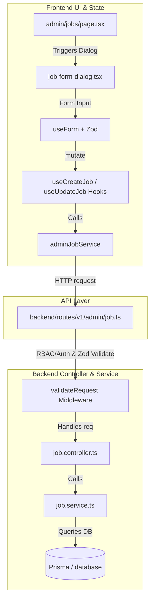

# Placement Management System — Admin Job Posting Architecture

This document provides a highly detailed walkthrough of the current job posting and management lifecycle for admins. It catalogs all relevant files, endpoints, components, and data structures in the codebase to serve as the exact context for any future enhancements.

---

## 1. Architectural Overview

The job posting system is split between a robust **TypeScript + Express + Prisma + Zod** backend and a modern **Next.js + Tailwind CSS + TanStack Query + React Hook Form** frontend.

---

## 2. Frontend Files & Components

Here are the central files that power the admin jobs listing, details, and creations:

| UI / Component Layer | File Path (Click to view) | Role |
| :--- | :--- | :--- |
| **Main Jobs Page** | [page.tsx](file:///e:/Devlopment%20101/Tnp-placement-final-year/frontend/src/app/admin/jobs/page.tsx) | Handles lists, skeletons, status toggles, pagination, and anchors creation/edition/deletion dialog states. |
| **Job Details & Applicants** | [page.tsx](file:///e:/Devlopment%20101/Tnp-placement-final-year/frontend/src/app/admin/jobs/%5BjobId%5D/page.tsx) | Displays job specifications, applicant data grids with multi-select, and triggers application status updates (e.g. `SHORTLISTED`, `SELECTED`). |
| **Job Form Dialog** | [job-form-dialog.tsx](file:///e:/Devlopment%20101/Tnp-placement-final-year/frontend/src/components/admin/jobs/job-form-dialog.tsx) | A multi-mode `Dialog` (`DialogContent`) which handles both **Create** and **Update** modes using `react-hook-form` and `@hookform/resolvers/zod`. |
| **Job Filters** | [job-filters.tsx](file:///e:/Devlopment%20101/Tnp-placement-final-year/frontend/src/components/admin/jobs/job-filters.tsx) | Renders input boxes, state pickers, and branch checkboxes, debouncing search parameters to prevent excessive API hits. |
| **Job Delete Dialog** | [delete-job-dialog.tsx](file:///e:/Devlopment%20101/Tnp-placement-final-year/frontend/src/components/admin/jobs/delete-job-dialog.tsx) | Handles confirmation flow and calls `useDeleteJob` mutation. |

---

## 3. Frontend API & Queries Integration

Under the hood, all HTTP interactions go through a service wrapper backed by **TanStack Query (v5)**.

### A. TypeScript Interfaces & Schemas
- **Schema & Types**: Located at [job.ts](file:///e:/Devlopment%20101/Tnp-placement-final-year/frontend/src/types/admin/job.ts).
- **Zod Fields**: Defines `createJobSchema` and `updateJobSchema`.
  - **Branches Enum**: CSE, ETE, EE, ME, IE, CE, CHE, IPE, MCA.
  - **Job Status Enum**: `DRAFT`, `ACTIVE`, `DEACTIVE`.
  - **Defaults**: Status is `.optional()` to match the backend schema, and defaults to `"DRAFT"` on creation.

### B. Service Class
Located at [job.service.ts](file:///e:/Devlopment%20101/Tnp-placement-final-year/frontend/src/services/admin/job.service.ts).
- `getAllJobs(filters)`: `GET /admin/job`
- `getJobById(id)`: `GET /admin/job/${id}`
- `createJob(data)`: `POST /admin/job` (converts deadline to ISO standard)
- `updateJob(id, data)`: `PATCH /admin/job/${id}`
- `activateJob(id)`: `POST /admin/job/${id}/activate`
- `deactivateJob(id)`: `POST /admin/job/${id}/deactivate`
- `deleteJob(id)`: `DELETE /admin/job/${id}`

### C. TanStack Query Hooks
Located at [useAdminJobs.ts](file:///e:/Devlopment%20101/Tnp-placement-final-year/frontend/src/hooks/admin/useAdminJobs.ts).
- `useAdminJobs(filters)`: Fetches matching jobs using standard cache keys.
- `useAdminJob(id)`: Fetches a single job detail.
- `useCreateJob()`: Performs post-request and invalidates `ADMIN_JOBS` queries on success, showing custom Sonner toasts.
- `useUpdateJob(id)`: Performs patch update and invalidates specific list/detail cache keys.
- `useToggleJobStatus()`: Resolves current status and executes either `activateJob` or `deactivateJob`.
- `useDeleteJob()`: Performs deletion request and invalidates list keys.

---

## 4. Backend Endpoints & Validations

The backend implements security, validation, and database storage via the following stack:

- **Router**: [job.ts](file:///e:/Devlopment%20101/Tnp-placement-final-year/backend/src/routes/v1/admin/job.ts)
- **Controller**: [job.controller.ts](file:///e:/Devlopment%20101/Tnp-placement-final-year/backend/src/modules/admin/controllers/job.controller.ts)
- **Service**: [job.service.ts](file:///e:/Devlopment%20101/Tnp-placement-final-year/backend/src/modules/admin/services/job.service.ts)
- **Zod Schema**: [job.ts](file:///e:/Devlopment%20101/Tnp-placement-final-year/backend/src/types/admin/job.ts)

### A. Route Map & Route Middleware

All routes listed below go through `authMiddleware` and are secured via `requireAdmin` (Role-Based Access Control) to make sure students cannot manipulate recruitment drives.

| Method | Endpoint Path | Middlewares / Validators | Controller Method |
| :--- | :--- | :--- | :--- |
| **GET** | `/api/v1/admin/job` | `authMiddleware` | `getAllJobsController` |
| **GET** | `/api/v1/admin/job/dashboard` | `authMiddleware`, `requireAdmin` | `getApplicationDashboardController` |
| **GET** | `/api/v1/admin/job/:id` | `authMiddleware`, `validateParams(idSchema)` | `getJobByIdController` |
| **GET** | `/api/v1/admin/job/:id/applicants` | `authMiddleware`, `requireAdmin`, `validateParams(idSchema)` | `getJobApplicantsController` |
| **POST** | `/api/v1/admin/job` | `authMiddleware`, `requireAdmin`, `validateRequest(createJobSchema)` | `createJobController` |
| **PATCH** | `/api/v1/admin/job/:id` | `authMiddleware`, `requireAdmin`, `validateParams(idSchema)`, `validateRequest(updateJobSchema)` | `updateJobByIdController` |
| **POST** | `/api/v1/admin/job/:id/activate` | `authMiddleware`, `requireAdmin`, `validateParams(idSchema)` | `activateJobController` |
| **POST** | `/api/v1/admin/job/:id/deactivate` | `authMiddleware`, `requireAdmin`, `validateParams(idSchema)` | `deactivateJobController` |
| **DELETE**| `/api/v1/admin/job/:id` | `authMiddleware`, `requireAdmin`, `validateParams(idSchema)` | `deleteJobByIdController` |

### B. Zod validation constraints (`backend/src/types/admin/job.ts`)
The backend validates request payloads strictly:
- `title`: `z.string().min(3)`
- `company`: `z.string().min(2)`
- `description`: `z.string().min(10)`
- `requiredCgpa`: `z.number().min(0).max(10)`
- `allowedBranches`: `z.array(z.enum(Branch))`
- `backlogAllowed`: `z.boolean()`
- `status`: `z.enum(JobStatus).optional()`
- `deadline`: Preprocessed string/date to yield a valid `Date` object.

> [!NOTE]
> The backend `updateJobSchema` is built using `createJobSchema.omit({ status: true }).partial()`. This design decision prevents manual, unintended edits to the job status via the general update form, forcing status controls to go strictly through the `/activate` and `/deactivate` post endpoints.

> [!IMPORTANT]
> To enforce that all new recruitment drives are created in the **Draft** state first, the frontend `createJobSchema` status field has been made `.optional()`, and the `JobFormDialog` defaults the status to `"DRAFT"`. This allows the admin to review the job, and then explicitly click the **Activate** button on the dashboard or detailed page to publish it to students.
>
> Email notifications are strictly constrained to only trigger when the job moves from the **DRAFT** state to the **ACTIVE** state (initial activation). Subsequent reactivation from the **DEACTIVE** state will not dispatch notification emails again, preventing email spam.

---

## 5. Design & User Experience Principles

As per our project style guides, the UI operates under these key parameters:
- **Borders & Radii**: Base `--radius: 0.625rem` (10px). Subtle card borders (`rgba(0, 0, 0, 0.07)` or `#202020` in dark mode).
- **Backgrounds**: Linear background gradients (`#66a6ff` 28% opacity to `#89f7fe` 18% opacity) are limited to light mode **root page backgrounds**. Cards and panels remain solid white or pure dark `#141414`.
- **Button Styling**: Primary buttons leverage a specific gradient: `linear-gradient(135deg, #818cf8, #c084fc)` (lavender to violet).
- **Loading / Submissions**: Submits must dynamically disable buttons and show `Loader2` spin icons to prevent double-post submissions.
