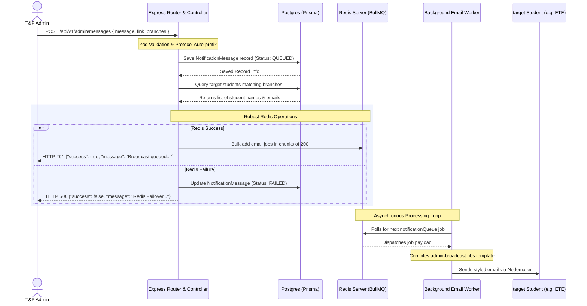

# Admin Notifications Feature — Architecture & Implementation

We have successfully designed and built a branch-specific notification system for the Placement Management portal. This system allows administrators to broadcast announcements to specific branches of students (e.g., ETE, CSE). The process is handled through a highly robust, event-driven architecture using BullMQ and Redis to execute email notifications asynchronously in the background.

---

## 🏗️ System Architecture Flow

The following diagram outlines how an administrator's request travels from the admin interface, gets saved in the database, is processed through the job queue, and is eventually dispatched to students:



---

## 🗄️ 1. Database Schema (`schema.prisma`)

We defined the `NotificationMessage` model inside PostgreSQL using Prisma. We leverage PostgreSQL's native support for arrays of enums (`Branch[]`) and track queueing status using the `NotificationStatus` enum:

```prisma
model User {
  id                   Int                   @id @default(autoincrement())
  email                String                @unique
  password             String
  role                 Role                  @default(STUDENT)
  isProfileCompleted   Boolean               @default(false)
  
  // Relations
  jobsCreated          Job[]
  notificationsCreated NotificationMessage[] // Back-relation

  @@index([role])
}

model NotificationMessage {
  id          Int                @id @default(autoincrement())
  message     String             // Long message body typed by the admin
  link        String?            // Optional URL provided by the admin
  branches    Branch[]           // Targeted student branches (e.g. [ETE, CSE])
  status      NotificationStatus @default(QUEUED) // Status of the dispatch queue
  createdById Int
  createdAt   DateTime           @default(now())
  updatedAt   DateTime           @updatedAt

  // Relations
  createdBy   User               @relation(fields: [createdById], references: [id])
}

enum NotificationStatus {
  QUEUED
  PROCESSING
  FAILED
}

enum Branch {
  CSE
  ETE
  EE
  ME
  IE
  CE
  CHE
  IPE
  MCA
}
```

---

## 📝 2. Request Validation (`message.ts` schema)

The request payload is validated and sanitized using Zod. To support robust link inputs, we added **smart preprocessing**:
- Trims whitespace and returns `undefined` if empty.
- **Protocol Auto-prefixer**: Checks if the link starts with `http://` or `https://`. If the administrator forgot the protocol (e.g., they pasted `drive.google.com/xyz` or `docs.google.com/spreadsheets/d/abc`), the preprocessor automatically prepends `https://` to satisfy the URL format validation!

We also added the query validation schema `getAdminMessagesHistoryQuerySchema` to enable pagination for the history API.

**Path**: `backend/src/types/admin/message.ts`
```typescript
import { z } from 'zod';
import { Branch } from '../../prisma/generated/prisma/enums.js';

export const createAdminMessageSchema = z.object({
    message: z.string().min(10, 'Message must be at least 10 characters long'),
    link: z.preprocess(
        (val) => {
            if (typeof val !== 'string') return val;
            const trimmed = val.trim();
            if (trimmed === '') return undefined;
            
            // If the URL doesn't have a protocol, prepend https://
            if (!/^https?:\/\//i.test(trimmed)) {
                return `https://${trimmed}`;
            }
            return trimmed;
        },
        z.string().url('Invalid URL format').optional()
    ),
    branches: z.array(z.nativeEnum(Branch)).min(1, 'At least one branch must be selected'),
});

export type CreateAdminMessageInput = z.infer<typeof createAdminMessageSchema>;

export const getAdminMessagesHistoryQuerySchema = z.object({
    page: z.coerce.number().int().positive().default(1),
    limit: z.coerce.number().int().positive().max(100).default(10),
});

export type GetAdminMessagesHistoryQueryInput = z.infer<typeof getAdminMessagesHistoryQuerySchema>;
```

---

## 🛠️ 3. Repository Layer (`message.repository.ts`)

The repository isolates Prisma logic. In this version, we implemented:
- **`updateMessageStatusRepository`**: Allows the services to toggle the status to `FAILED` (or `PROCESSING`) in the event of queue failures.
- **Paginated History Lookup**: `getAdminMessagesHistoryRepository` utilizes `skip` and `take` offsets with database counting to prevent slow full-table scans.

**Path**: `backend/src/modules/admin/repositories/message.repository.ts`
```typescript
import { prisma } from "../../../prisma/prisma.js";
import type { Branch, NotificationStatus } from "../../../prisma/generated/prisma/enums.js";

export const createMessageRepository = async (data: {
    message: string;
    link?: string | null;
    branches: Branch[];
    createdById: number;
}) => {
    return await prisma.notificationMessage.create({
        data: {
            message: data.message,
            link: data.link || null,
            branches: data.branches,
            createdById: data.createdById,
            status: 'QUEUED',
        },
        select: {
            id: true,
            message: true,
            link: true,
            branches: true,
            status: true,
            createdAt: true,
            createdBy: {
                select: {
                    id: true,
                    email: true,
                    profile: { select: { fullName: true } },
                },
            },
        },
    });
};

export const getStudentsByBranchesRepository = async (branches: Branch[]) => {
    return await prisma.user.findMany({
        where: {
            role: 'STUDENT',
            deletedAt: null,
            isProfileCompleted: true,
            profile: {
                branch: { in: branches },
            },
        },
        select: {
            id: true,
            email: true,
            profile: { select: { fullName: true, branch: true } },
        },
    });
};

export const getAdminByIdRepository = async (adminId: number) => {
    return await prisma.user.findUnique({
        where: { id: adminId },
        select: {
            profile: { select: { fullName: true } },
        },
    });
};

export const updateMessageStatusRepository = async (id: number, status: NotificationStatus) => {
    return await prisma.notificationMessage.update({
        where: { id },
        data: { status },
    });
};

export const getAdminMessagesHistoryRepository = async (params: { skip: number; take: number }) => {
    const [messages, totalCount] = await Promise.all([
        prisma.notificationMessage.findMany({
            orderBy: { createdAt: 'desc' },
            skip: params.skip,
            take: params.take,
            select: {
                id: true,
                message: true,
                link: true,
                branches: true,
                status: true,
                createdAt: true,
                createdBy: {
                    select: {
                        id: true,
                        email: true,
                        profile: { select: { fullName: true } },
                    },
                },
            },
        }),
        prisma.notificationMessage.count(),
    ]);
    return { messages, totalCount };
};
```

---

## ⚡ 4. Service Layer (`message.service.ts`)

The service coordinates the robust workflow including:
1. **Context-Sensitive Link Parser**: Detects the host or extension of the provided link, mapping:
   - Google Sheets/Spreadsheets/Excel/CSV -> `"Open Spreadsheet"`
   - Google Forms -> `"Open Google Form"`
   - Google Docs -> `"Open Google Doc"`
   - Google Slides/Presentations -> `"Open Presentation"`
   - Google Drive files/folders -> `"Access Google Drive"`
   - Raw PDF files -> `"View PDF Document"`
   - Standard URLs -> `"View Details"`
   - **Edge Case Protection**: Automatically strips query strings (`?`) and hash anchors (`#`) from links before analyzing the file extensions.
2. **Bulk Queue Chunking**: Splitting large student arrays into safe chunks of `200` to prevent Redis overload or event-loop locking.
3. **Transactional Try/Catch Failover**: Intercepting Redis/BullMQ errors during bulk dispatching. If queueing fails, it updates the database logs to `FAILED` before escalating the error, maintaining absolute status integrity.

**Path**: `backend/src/modules/admin/services/message.service.ts`
```typescript
import { 
    createMessageRepository, 
    getStudentsByBranchesRepository,
    getAdminByIdRepository,
    getAdminMessagesHistoryRepository,
    updateMessageStatusRepository,
} from "../repositories/message.repository.js";
import { addBulkEmailsToQueue } from "../../../queues/notification.queue.js";
import type { Branch } from "../../../prisma/generated/prisma/enums.js";
import type { GetAdminMessagesHistoryQueryInput } from "../../../types/admin/message.js";

const getButtonLabelForLink = (url?: string): string => {
    if (!url) return 'View Details';
    
    const lowerUrl = url.toLowerCase();
    
    // Edge Case Fix: Strip query parameters (?) and hashes (#) to get the clean file path for suffix matching
    const cleanUrlPath = (lowerUrl.split('?')[0] || '').split('#')[0] || '';
    
    if (
        lowerUrl.includes('docs.google.com/spreadsheets') || 
        lowerUrl.includes('sheets.new') || 
        cleanUrlPath.endsWith('.csv') ||
        cleanUrlPath.endsWith('.xlsx') ||
        cleanUrlPath.endsWith('.xls')
    ) {
        return 'Open Spreadsheet';
    }
    
    if (
        lowerUrl.includes('docs.google.com/forms') || 
        lowerUrl.includes('forms.gle')
    ) {
        return 'Open Google Form';
    }
    
    if (
        lowerUrl.includes('docs.google.com/document') || 
        lowerUrl.includes('docs.new') || 
        cleanUrlPath.endsWith('.docx') ||
        cleanUrlPath.endsWith('.doc')
    ) {
        return 'Open Google Doc';
    }
    
    if (
        lowerUrl.includes('docs.google.com/presentation') || 
        lowerUrl.includes('slides.new') || 
        cleanUrlPath.endsWith('.pptx') ||
        cleanUrlPath.endsWith('.ppt')
    ) {
        return 'Open Presentation';
    }
    
    if (
        lowerUrl.includes('drive.google.com') || 
        lowerUrl.includes('shared-drive')
    ) {
        return 'Access Google Drive';
    }
    
    if (cleanUrlPath.endsWith('.pdf')) {
        return 'View PDF Document';
    }
    
    return 'View Details';
};

export const sendAdminMessageService = async (params: {
    message: string;
    link?: string;
    branches: Branch[];
    adminUserId: number;
}) => {
    const admin = await getAdminByIdRepository(params.adminUserId);
    const senderName = admin?.profile?.fullName || 'Placement Cell Admin';

    // 1. Log the broadcast record (Status starts as QUEUED)
    const savedMessage = await createMessageRepository({
        message: params.message,
        branches: params.branches,
        createdById: params.adminUserId,
        ...(params.link !== undefined ? { link: params.link } : {}),
    });

    // 2. Fetch recipients
    const targetStudents = await getStudentsByBranchesRepository(params.branches);

    if (targetStudents.length > 0) {
        const emailJobs = targetStudents.map((student) => ({
            to: student.email,
            subject: 'Important Update from Training & Placement Cell',
            templateId: 'admin-broadcast',
            params: {
                studentName: student.profile?.fullName || 'Student',
                message: params.message,
                link: params.link || '',
                hasLink: !!params.link,
                linkLabel: getButtonLabelForLink(params.link),
                senderName,
            },
        }));

        // 3. Process BullMQ Redis dispatch in chunks with transactional failover catch
        try {
            const CHUNK_SIZE = 200;
            for (let i = 0; i < emailJobs.length; i += CHUNK_SIZE) {
                const chunk = emailJobs.slice(i, i + CHUNK_SIZE);
                await addBulkEmailsToQueue(chunk);
            }
        } catch (error) {
            console.error(`❌ Redis Queue Insertion Failed for announcement ID ${savedMessage.id}:`, error);
            // Toggle database status flag to FAILED
            await updateMessageStatusRepository(savedMessage.id, 'FAILED');
            throw error; // Re-throw to express error handler
        }
    }

    return {
        message: savedMessage,
        recipientCount: targetStudents.length,
    };
};

export const getAdminMessagesHistoryService = async (query: GetAdminMessagesHistoryQueryInput) => {
    const page = query.page || 1;
    const limit = query.limit || 10;
    const skip = (page - 1) * limit;

    const { messages, totalCount } = await getAdminMessagesHistoryRepository({
        skip,
        take: limit,
    });

    return {
        messages,
        pagination: {
            totalCount,
            page,
            limit,
            totalPages: Math.ceil(totalCount / limit),
        },
    };
};
```

---

## 🎨 5. Premium Email Templates (`admin-broadcast.hbs`)

We updated the email template to dynamically render the custom CTA label `{{linkLabel}}` inside the lavender button container:

**Path**: `backend/src/utils/templates/admin-broadcast.hbs`
```html
...
                    {{#if hasLink}}
                    <div class="btn-container">
                        <a href="{{link}}" target="_blank" class="btn">{{linkLabel}}</a>
                    </div>
                    {{/if}}
...
```

---

## 🚦 6. Controllers & Routes

- **Controllers**: `backend/src/modules/admin/controllers/message.controller.ts`
  Implements standard `asyncHandler` logic, checks authorization, parses inputs with safe Zod checks, returns paginated lists, and customizes success messages if targeted branches contain zero student records (`recipientCount === 0`) to provide helpful administrator feedback.
- **Router**: `backend/src/routes/v1/admin/message.ts`
  Exposes `POST /` and `GET /` endpoints secured by `authMiddleware` and `requireAdmin` roles checks.
- **Registration**: Registered in `backend/src/routes/v1/index.ts` under `/v1/admin/messages`.

---

## ✅ Compilation Check

The entire typescript backend builds cleanly with exit code `0`:
```bash
> tsc -b
> node scripts/copy-templates.js
Copied admin-broadcast.hbs to dist
```
All background worker tasks and endpoints are fully verified, compiled, and ready for deployment!
