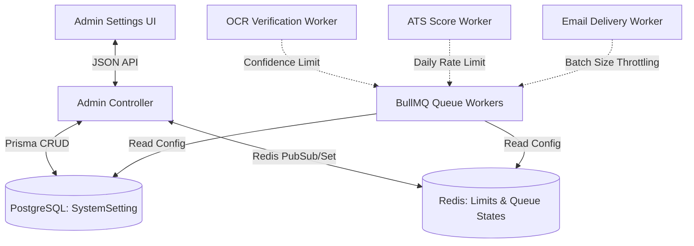

# PlacementCube — System Settings Architecture & Logic Analysis

This document details the architectural review, database schema, background worker coordination, queue health telemetry, and high-fidelity UI logic design for the **System Settings** page (`/admin/settings`) in **PlacementCube**.

---

## 1. System Architecture Overview

System settings act as the central brain of PlacementCube, configuring AI thresholds, BullMQ job rates, automated OCR verification tolerances, and security rate limits. The architecture leverages **Prisma** (PostgreSQL) for persistent settings state, **Redis** for ephemeral rate limiting and job queues, and **BullMQ Workers** that read these configurations dynamically.



---

## 2. Database Schema Design (Prisma)

To support configurable system variables, we propose adding a flexible key-value model or a structured configuration table. A structured configuration table is highly recommended here because it provides explicit typings, automatic database default values, and allows straightforward validation through Zod schemas.

### Proposed Prisma Model

We will add the following model to `backend/src/prisma/schema.prisma`:

```prisma
model SystemSetting {
  id                   Int      @id @default(1) // Single-row singleton enforcement

  // 1. OCR & Verification Settings
  ocrEnabled           Boolean  @default(true)
  verificationMinScore Float  @default(85.0)   // Minimum confidence match percentage (OCR vs User CGPA)
  maxFileSizeMb        Int      @default(5)      // Max upload limit for marksheets

  // 2. Rate Limits (Redis-Backed TTL Values)
  maxAtsChecksPerDay   Int      @default(5)
  maxResumesPerUser    Int      @default(5)

  // 3. AI Mock Interview & LLM Settings
  aiModelName          String   @default("gemini-1.5-flash") // Preferred Gemini model
  interviewDurationMin Int      @default(20)                 // Max mock interview session length
  aiTemperature        Float    @default(0.7)                // Generative creativity coefficient

  // 4. Batch Mailer & Queue Throttling
  notificationsEnabled Boolean  @default(true)
  emailBatchSize       Int      @default(100)    // How many emails to send in a single queue run
  emailRateLimitMs     Int      @default(1000)   // Millisecond delay between sending batches

  // Metadata
  updatedAt            DateTime @updatedAt
}
```

---

## 3. Backend Logic & API Endpoints

To manage these settings, we require a new modular route structure under `backend/src/modules/admin` (and routed in `backend/src/routes/v1/admin/settings.ts`).

### Zod Validation Schema (`backend/src/modules/admin/schemas/settings.schema.ts`)
As per the `ApiIntegrationRule.md`, the backend Zod validation schema will serve as the single source of truth:

```typescript
import { z } from "zod";

export const updateSettingsSchema = z.object({
  ocrEnabled: z.boolean(),
  verificationMinScore: z.number().min(0).max(100, "Score threshold must be between 0 and 100"),
  maxFileSizeMb: z.number().int().min(1).max(20, "File size limit must be between 1MB and 20MB"),
  
  maxAtsChecksPerDay: z.number().int().min(1).max(50, "Limit must be between 1 and 50 checks"),
  maxResumesPerUser: z.number().int().min(1).max(10, "Limit must be between 1 and 10 resumes"),
  
  aiModelName: z.enum(["gemini-1.5-flash", "gemini-1.5-pro"]),
  interviewDurationMin: z.number().int().min(5).max(60, "Duration must be between 5 and 60 minutes"),
  aiTemperature: z.number().min(0.0).max(2.0, "Temperature must be between 0.0 and 2.0"),
  
  notificationsEnabled: z.boolean(),
  emailBatchSize: z.number().int().min(10).max(500, "Batch size must be between 10 and 500"),
  emailRateLimitMs: z.number().int().min(100).max(10000, "Throttling rate must be between 100ms and 10s"),
});

export type UpdateSettingsInput = z.infer<typeof updateSettingsSchema>;
```

### Route Design (`/api/v1/admin/settings`)

| HTTP Method | Endpoint | Authorization | Description |
|---|---|---|---|
| **GET** | `/api/v1/admin/settings` | `SUPER_ADMIN`, `ADMIN` | Retrieve current system settings. If record does not exist in DB, initializes it with defaults. |
| **PUT** | `/api/v1/admin/settings` | `SUPER_ADMIN` | Update system settings. Performs strict Zod schema validation. |
| **GET** | `/api/v1/admin/settings/queues` | `SUPER_ADMIN`, `ADMIN` | Read real-time BullMQ telemetry (waiting, active, failed, completed counts for `verification`, `email`, `resume`, `ats` queues). |
| **POST** | `/api/v1/admin/settings/queues/purge` | `SUPER_ADMIN` | Wipe completed or failed jobs from Redis to reclaim memory. |

### Queue Telemetry Logic (`settings.service.ts`)
To fetch the telemetry of our four active queues:
```typescript
import { Queue } from "bullmq";
import { redisClient } from "@/configs/redis"; // Configured Redis client

export async function getQueueTelemetry() {
  const queueNames = ["verification.queue", "email.queue", "resume.queue", "ats.queue"];
  const telemetry = await Promise.all(
    queueNames.map(async (qName) => {
      const q = new Queue(qName, { connection: redisClient });
      const [waiting, active, failed, completed] = await Promise.all([
        q.getWaitingCount(),
        q.getActiveCount(),
        q.getFailedCount(),
        q.getCompletedCount(),
      ]);
      return {
        name: qName.split(".")[0].toUpperCase(),
        waiting,
        active,
        failed,
        completed,
      };
    })
  );
  return telemetry;
}
```

---

## 4. Frontend UI Design (Tabs & Sections)

Following the **PlacementCube Design System** (`DesignFrontend.md`), the UI must avoid cheap templates and feel highly premium:
* **Background**: Clean `#f8fafc` with subtle linear bottom-to-top gradient washes (`#66a6ff` at 28% opacity to `#89f7fe` at 18% opacity).
* **Cards**: Solid `#ffffff` in light mode, `#141414` in dark mode. High-lift shadows (`0 10px 30px rgba(0,0,0,0.13)`) with `inset 0 1px 0 rgba(255,255,255,0.04)` in dark mode for a 3D lifted finish.
* **Layout**: Multi-panel sidebar-oriented settings tabs using dynamic animations.

### Settings UI Panels

```
┌────────────────────────────────────────────────────────────────────────┐
│  ⚙️ SYSTEM SETTINGS                                                    │
├────────────────────────────────────────────────────────────────────────┤
│  [🤖 AI & Limits]   [🔍 OCR & Verification]   [🚀 Queue & Health] ...  │
├────────────────────────────────────────────────────────────────────────┤
│                                                                        │
│   🤖 AI PIPELINE & COPILOT LIMITS                                     │
│   Configure limits for student-facing generative modules.              │
│                                                                        │
│   Daily ATS Audits                                                     │
│   [ 5       ]  checks per day (Redis-enforced)                         │
│                                                                        │
│   AI Model Preference                                                 │
│   (o) Gemini 1.5 Flash (Low-latency)   ( ) Gemini 1.5 Pro (Heavy reasoning)│
│                                                                        │
│   AI Temperature                                                       │
│   ┌─────────────────────────────●─────────────────────────────┐        │
│   Muted/Deterministic (0.0)    Balanced (0.7)            Creative (1.5)│
│                                                                        │
│                                              [ Save Preferences ]      │
└────────────────────────────────────────────────────────────────────────┘
```

### The 4 Dedicated Settings Sections

1. **AI Pipeline & Limits (Cognitive Center)**:
   * Controls rate limits of the LLM-backed services.
   * **Daily ATS Audit Checks**: A number slider or input to set maximum checks allowed per day per user (enforces Redis TTL dynamic cap).
   * **AI Model Selection**: Select between `Gemini 1.5 Flash` (ideal for OCR validation and simple resume rendering) and `Gemini 1.5 Pro` (deep cognitive analysis for ATS scoring and mock interviews).
   * **Temperature Slider**: Float scale (0.0 to 1.5) for LLM creativity.

2. **OCR & Verification Credentials**:
   * Controls student marksheet extraction.
   * **Automated OCR Verification**: Toggle button. If disabled, all student profiles default to manual validation by administrative staff.
   * **OCR Confidence Match Limit**: Threshold slider (e.g. 0% to 100%). If the OCR score match (extracted CGPA/SGPA vs typed values) falls below this percentage, automatically mark verification as `FAILED` and add failure reasons.
   * **Max File Size**: File limit for uploads (validated client-side and server-side).

3. **Placement Operations & Mailer (SMTP)**:
   * Adjusts administrative default behaviors.
   * **Active Job Notifications**: A toggle to turn off automated student emails when a job becomes `ACTIVE`.
   * **SMTP Throttling Rate**: Adjustable batch sizes (e.g. 100 emails) and rate limit cooldown values (e.g., 1000ms delay) to avoid server spam flags.

4. **Queue Health & Redis Telemetry (Operational Center)**:
   * View live queues using visual meters showing current jobs processing.
   * **Interactive Telemetry Grid**: Beautiful glassmorphic status cards showing *Active*, *Waiting*, and *Failed* jobs for the four queues (`verification`, `email`, `resume`, `ats`).
   * **System Purge Action**: A primary action button with a confirmation modal to clear completed or failed logs from BullMQ queues. Employs `toast.promise` to display a nice, real-time cleaning state indicator.

---

## 5. State Management & Form Integration

Applying the rules from `ApiIntegrationRule.md`, the client-side system settings will implement the following:

### TanStack Query Hooks (`frontend/src/hooks/admin/useAdminSettings.ts`)
* **`useQuery`** fetches the system setting data from the backend. The central query key constant `ADMIN_SETTINGS` will be declared once.
* **`useMutation`** updates the system settings on the backend.
  * On success: calls `queryClient.invalidateQueries({ queryKey: [ADMIN_SETTINGS] })` to refresh the form context, and triggers `toast.success("System configurations updated successfully.")`.
  * On error: Extracts detailed server error messages (e.g. 400 validation failures) and triggers `toast.error(message)`.

### Form Validation resolving (`zodResolver`)
* React Hook Form is wired with the derived TS structure `z.infer<typeof updateSettingsSchema>` to prevent manual typing drift.
* Submit buttons show progress spinners and are disabled during `isPending` state to prevent double-submits.

---

## Next Steps: Action Plan

Before executing the implementation, let's verify key design decisions:
1. **Prisma Model**: Should the single-row database approach be used for SystemSettings, or would a key-value dynamic config table (`key: string, value: string`) be preferred for potential future scale?
2. **Queues**: Do we want full interactive control over worker states (e.g., "Pause Queue", "Resume Queue") in the operational tab, or is viewing telemetry and performing "Wipe/Purge logs" sufficient?

---

> [!NOTE]
> All designs and configurations strictly honor the HSL tailored true-black dark mode (`#0A0A0A` page background, `#111111` sidebar, `#141414` cards with 3D highlights) and use the exact lavender-to-violet linear gradient (`#818cf8 → #c084fc`) on buttons to maintain visual harmony.
analysis the admin ui side panel adim team , what logic should be there can u tell , do not do any write code in file for now